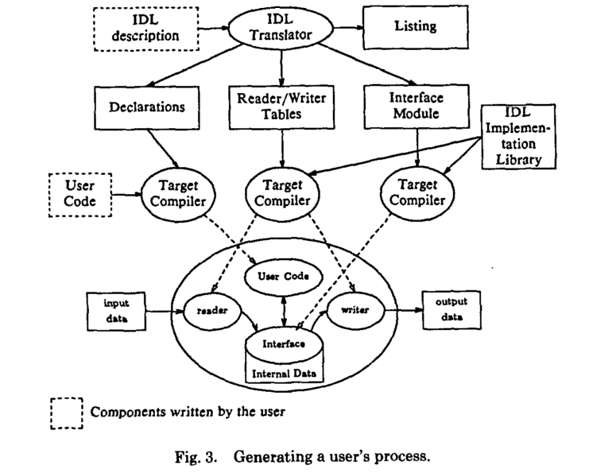
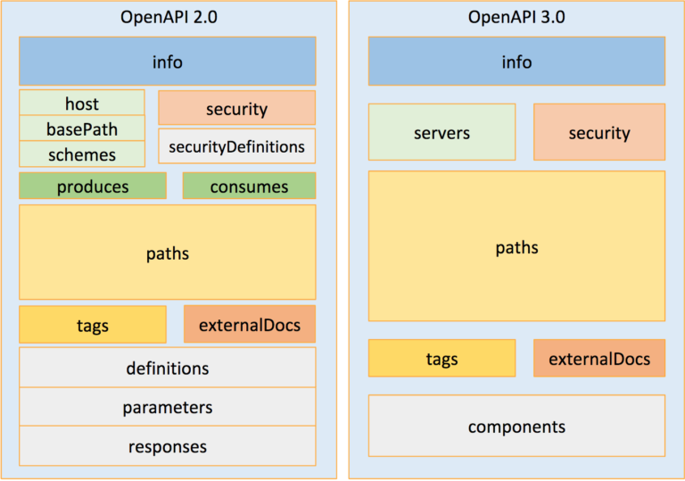

layout: true
name: empty
---
layout: true
---
class: center, middle

## Future Cloud Applications Meetup
##### 2018-06-26 in Zürich
# Exploring OpenAPI State And Tools
### Talk by Stefan Junker from ZHAW


???

---
class: center, middle

#### Slides @ https://steveej.github.io/slides/meetup-futurecloudapplications-2018-06-26


---

.middle-column[
.footnote[**Questions are welcome during the talk**]

## Exploring OpenAPI State And Tools

.inner-center[
### I. API Descriptions Rationale
### II.  OpenAPI Overview
### III. Security Examples
### IV. Conclusion

<br>
### Previous related talk
https://steveej.github.io/slides/zhaw-techtalk-0
]

]

---
name: api_desc_rationale::idl
layout: true
<div class="my-footer">Stefan Junker @ FCA 2018-06-26</div>
.left-column[

## I. API Descriptions Rationale
### II.  OpenAPI Overview
### III. Security Examples
### IV. Conclusion

]
---
template: api_desc_rationale::idl
.right-column[
#### Interface Description Language: Sharing intermediate representations
Author: David Alex Lamb, 1985, Queen’s University

##### Motivation
> Improving programmer productivity

##### Method
> Integration of tools

##### Use-Case
Systems that run large programs, which..
> * communicate via complex data structures.
> * might be written in different programming languages and might run on different hardware.
> * have internal data representations which must be tailored
]
---
template: api_desc_rationale::idl
.right-column[
#### Components

> A **tool** for controlling the exchange of structured data between different components of a large system.

> A **notation** for describing collections of programs and the data structures through which they communicate.

> A **designer** gives abstract descriptions of data structures, together with representation specifications that specialize the abstract structures for particular programs.

> A **translator** that generates readers and writers that map between concrete internal representations and abstract exchange representations.

#### Scope of IDL
* .green[Representation and conversion of data]
* .red[Session/Connection handling is out-of-scope]
]

???

### Networks in 1988 were not as dangerous and like today

### Skip syntax cause it's confusing

---
template: api_desc_rationale::idl
.right-column[
### Minimized amount of code written by the user
> 
]

???

### Only two components written by the user
---
template: api_desc_rationale::evolution
.right-column[
### API Design First Workflow
1. .green[Design the initial API Description in iterations]

  Close-to-business-domain design requires requires no decision or understanding of programming language(s)

2. .green[Generate documentation], .yellow[server and client stubs]

  Depends strongly on tooling

3. .blue[Enrich stubs with business logic]

  Future stub updates and implemented business logic require merging

### Benefits
* Early alignment of business logic, data model and external access
* Write less boilerplate code
]
---
template: api_desc_rationale::evolution
.right-column[

### Mostly industrial progress
* Big and small organizations, and also individuals are involved in this problem space
* Many commercial tools for writing and managing API descriptions
* Open Source activity, including Linux Foundation and Cloud Native Computing Foundation

### History
A quick look at relevant technological history...
]
---
template: api_desc_rationale::evolution
.right-column[
.footnote.small[*(Table data based on Wikipedia and respective product release channels)*]

.wide.internalborders[
Technology | Features | Author(s) | Year
:-: | :-: | :-: | :-:
IDL | Method and Structure Description Language, Tooling | Lamb et al. | 1985
WSDL 1 | Web Services Description Language for SOAP based web services | W3C / IBM, Microsoft, Ariba | 2000
.green[**REST**] | Architectural guideline for Web Services | Roy Fielding | 2000
Protocol Buffers 1 | Method and Structure Description Language, Data conversion, Tooling | Google | 2001
WSDL 2 | WSDL1 Simplified and support for RESTful services | W3C | 2007
Thrift | Method and Structure Description Language, tooling for simple data conversion, RPC protocol | Facebook | 2007
]

]
???

* World Wide Web Consortium (W3C)
* WSDL: Web Services Description Language

---
template: api_desc_rationale::evolution
.right-column[
.footnote.small[*(Table data based on Wikipedia and respective product release channels)*]

.wide.internalborders[
Technology | Features | Author(s) | Year
:-: | :-: | :-: | :-:
Protocol Buffers 2 | Method and Structure Description Language, Data conversion, Tooling | Google | 2008
WADL | Web Application Description Language for RESTful web services | Sun Microsystems | 2009
.green[OpenAPI 1 (Swagger)] | RESTful Method and Structure Description Language, Tooling | Reverb Technologies | 2011
.green[RAML] | RESTful/RPC Method and Structure Description Language, Tooling | MuleSoft, RAML Workgroup | 2013
Cap' N Proto | Method and Structure Description Language, 0-Copy data conversion, Tooling, RPC Protocol | K. Varda (ProtoBuf 2 Author) | 2013
]

]
---
template: api_desc_rationale::evolution
.right-column[
.footnote.small[*(Table data based on Wikipedia and respective product release channels)*]

.wide.internalborders[
Technology | Features | Author(s) | Year
:-: | :-: | :-: | :-:
.green[OpenAPI 2 (Swagger)] | Added features, especially **Extension Attributes**, Tooling | Reverb Technologies then bought by SmartBear | 2014
Protocol Buffers 3 | Method and Structure Description Language, Data conversion, Tooling | Google | 2016
GraphQL | Web Data Query Language Specification, Tooling | Facebook | 2016
.green[OpenAPI 3] | More features, Callbacks, References, etc. | Linux Foundation / OpenAPI Initiative: SmartBear (donators), MuleSoft, Google, Microsoft, etc. | 2017
]
]
---
template: api_desc_rationale::evaluation
.right-column[
### Choosing the Description Language
]
--
.right-column[
#### Requirements and Preferences

.wide[
Feature | Priority
:- | :-
Support .green[REST]ful interfaces | Required
Natively supports security descriptors | Required
Existing code generator support for Golang Client | Required
Existing code generator support for Golang Server | Desired .small[(might be handled by a Proxy)]
Open Source Tooling | Desired
Native support by at least one public cloud provider (API gateway) | Desired
]

]
--
.right-column[
##### Scope Limiting Decisions
* REST because it is highly adopted
* Golang due to personal familiarity and expectation of wide support for Web-Services
* Focus on RESTful web service descriptions
]

???

### Server Side can be handled via Proxy
---
layout: false
<div class="my-footer">Stefan Junker @ FCA 2018-06-26</div>
.center[**API Description Language Comparison**]
.wide.internalborders[
Candidate | Language Extensions | Golang Client Generator | Golang Server Generator | Cloud Provider Support | Comment
:-: | :-: | :-: | :-: | :-:
gRPC / Protobuf 3 | .yellow[No Meta-Level - only custom/`Any` types] | .green[Official] | .green[Official] | .green[Google Cloud] | .yellow[[Requires annotations for REST compatibility](https://github.com/googleapis/googleapis/blob/e9f101a23ca58f0d42f5fef52ddbc1ef55257506/google/api/http.proto#L82-L87)]
[OpenAPI 2](https://github.com/OAI/OpenAPI-Specification/blob/master/versions/2.0.md) | .green[[Attributes prefixed by `x-`](https://github.com/OAI/OpenAPI-Specification/blob/master/versions/2.0.md#specification-extensions) ] | .green[Official FOSS (swagger-codegen)] / .yellow[Other Freemium/Commercial]| same as client | .green[[Google Cloud](https://cloud.google.com/endpoints/docs/openapi/openapi-overview), AWS, IBM] | .green[[Native support for authentication schemes](https://github.com/OAI/OpenAPI-Specification/blob/master/versions/2.0.md#securityDefinitionsObject)]
[**OpenAPI 3**](https://github.com/OAI/OpenAPI-Specification/blob/master/versions/3.0.1.md) | .green[[Attributes prefixed by `x-`](https://github.com/OAI/OpenAPI-Specification/blob/master/versions/3.0.1.md#specification-extensions) ] | .red[[Official FOSS  WIP](https://github.com/swagger-api/swagger-codegen/issues/6598)] / .yellow[[FOSS 3rd party impl.](https://github.com/Mermade/openapi-codegen)] | same as client | .red[not found] | .green[[Native support for authentication schemes](https://github.com/OAI/OpenAPI-Specification/blob/master/versions/3.0.1.md#securitySchemeObject)]
[RAML](https://github.com/raml-org/raml-spec/blob/master/versions/raml-10/raml-10.md) | .green[[Annotations](https://github.com/raml-org/raml-spec/blob/master/versions/raml-10/raml-10.md/#annotations)] | .red[only through conversion to OpenAPI]  | *same as client* | *same as client* | .green[[Native support for authentication schemes](https://github.com/raml-org/raml-spec/blob/master/versions/raml-10/raml-10.md/#security-schemes)]
]
---
name: openapi-basics
layout: true
<div class="my-footer">Stefan Junker @ FCA 2018-06-26</div>
.left-column[
### I. API Descriptions Rationale
## II.  OpenAPI Overview
### III. Security Examples
### IV. Conclusion
]
---
template: openapi-basics

.right-column[
### OpenAPI 3
Resources for finding v3 compatible tooling:
* https://github.com/OAI/OpenAPI-Specification/blob/master/IMPLEMENTATIONS.md
* https://github.com/Mermade/awesome-openapi3
* http://openapi.tools


##### Tooling Use-cases
* **Server/SDK Generators**
* **Mock Servers**
* Documentation Rendering
* Converters
* Editors
* Parsers / Validators
* Testing
]
---
template: openapi-basics
.right-column[
**v3 Implementation Stats as of today**

Tool/Language| Number of Tools | Comments
-  |  -
Server Implementations  |  8 | .yellow[mostly commercial]
Low-Level tooling  |  7 | .green[Many FOSS Parsers, Validators]
Code Generators  |  7 | .yellow[FOSS Official/stable version WIP]
User Interfaces  |  5 | .green[FOSS Doc generators available]
Editors  |  4 |
  |
JavaScript/TypeScript  |  12/3
Java/EE  |  8/1
Ruby  |  5
Kotlin/Groovy  |  2/2
Go  |  2
Ceylon, Scala, PHP, XSLT, dotnet  |  1
]
---
template: openapi-basics

.right-column[
#### v3 Changes Overview
* Improved structure 
* Excellent Overview: https://blog.readme.io/an-example-filled-guide-to-swagger-3-2/
]
---
template: openapi-basics

.right-column[
#### v3 Schema Updates
Incomplete new feature list:
* Callbacks, Links: Useful for connecting/linking APIs and their responses
* URL Templates, JSON Schema support (anyOf, oneOf, not, nullable, ...): increases composability of Schema objects

Security Schema Improvements:
* Multiple OAuth2 Support
* OpenID Connect Support
* "scheme" and "bearerFormat" specifiable

]
---
name: security-examples
layout: true
<div class="my-footer">Stefan Junker @ FCA 2018-06-26</div>
.left-column[
### I. API Descriptions Rationale
### II.  OpenAPI Overview
## III. Security Examples
### IV. Conclusion
]
---
template: security-examples

.right-column[
### Secure Echo Service
* Require apiKey **OR** Google OpenID connect authentication on the `/echo` resource for the `POST` method;
* Allow *API_KEY* in a Pre-Shared-Key fashion configured via the environment
* Specification in OpenAPI v3.0 format

### Google OpenID Connect
Discovery Endpoint exposed as https://accounts.google.com/.well-known/openid-configuration
```json
{
  "issuer": "https://accounts.google.com",
  "authorization_endpoint": "https://accounts.google.com/o/oauth2/v2/auth",
  "token_endpoint": "https://www.googleapis.com/oauth2/v4/token",
  (...)
* "scopes_supported": [
*   "openid",
*   "email",
*   "profile"
* ],
  (...)
}
```
]
---
template: security-examples
.right-column[
### Secure Echo Service - Specification
```yml
openapi: 3.0.1
(...)
paths:
  /echo:
    post:
      summary: Securely POST a body and receive it back
      operationId: postEcho
      (...)
      responses:
        (...)
        '401':
          description: not authorized
          content:
            application/json:
              schema:
                $ref: "#/components/schemas/Error"
*     security:
*       - apiKey: []
*       - googleOpenId:
*         - email
(...)
```
]
---
template: security-examples
.right-column[
### Failed verification according to `speccy`
```
$ speccy lint demo/defs/3.0_secure-echo.yaml
Specification schema is invalid.

#/paths/~1echo/post/security
expected Array [ 'email' ] to be empty
```

<br>
### Time out...
OpenAPI v3 tooling is in its very early days, and testing the tools takes lots of time (especially wihout much JavaScript knowledge)

]
---
name: conclusion
layout: true
<div class="my-footer">Stefan Junker @ FCA 2018-06-26</div>
.left-column[
### I. API Descriptions Rationale
### II.  OpenAPI Overview
### III. Security Examples
## IV. Conclusion
]
---
template: conclusion

.right-column[
#### State of OpenAPI
##### Golang Code Generation for Secured Server/Client
* .red[**v3 has no production-level support by any known tool today**]
* .green[**v3 has substantial community and industry momentum**]

##### OpenAPI Features
* .green[Covers RESTful APIs]
* .red[No modeling support for combining REST/RPC model]
* .green[Wide feature support and easy to extend with custom attributes]
* .green[Efficient API design through reusable component definitions]
]
---
name: end
layout: true
class: center, middle
<div class="my-footer">Stefan Junker @ FCA 2018-06-26</div>

# Thank You
---